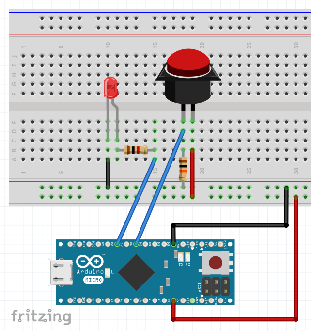

# togglemic v1.0

## Stealthily mute your mic

I'm reluctant to visibly switch off my mic during video meetings. That's why I have a keyboard shortcut mapped to the command `amixer set Capture toggle`, but XFCE doesn't have a straightforward way of displaying if my mic is muted or not. This is where **togglemic** comes into play! With a handy big button and an informative LED it shows me if my mic is hot or if I can hack away on my mechanical keyboard without disturbing other participants.

## Caveats and alternatives

I won't lie, I threw this together rather quickly so portability was not on my mind. There is one major caveat:

This sketch uses the [Keyboard library](https://www.arduino.cc/reference/en/language/functions/usb/keyboard/) which require a board with 32U4 or SAMD microcontroller. Getting a Nano, UNO or other type of microcontroller to work as a keyboard is also possible: [See here](http://mitchtech.net/arduino-usb-hid-keyboard/) for an example and [here](https://arduino.stackexchange.com/a/541) for another explanation.

There is also [this very nice project](https://github.com/DanNixon/pulseaudio-ptt) which interfaces with PulseAudio through a client Python script running on the PC directly.

Of course you could also use a keyboard shortcut to visibly mute the mic in Zoom/Skype/etc. directly [like here](https://www.instructables.com/Zoom-Meetings-Physical-Mute-Button/).

## Wiring and setup

